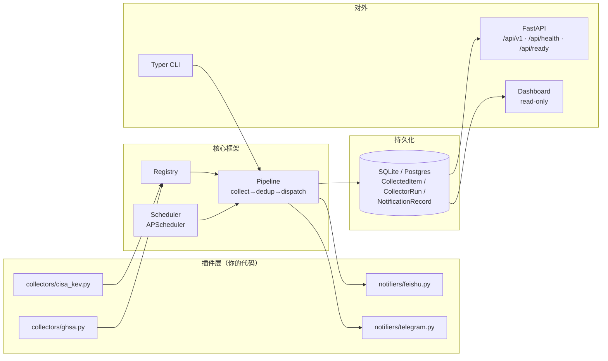
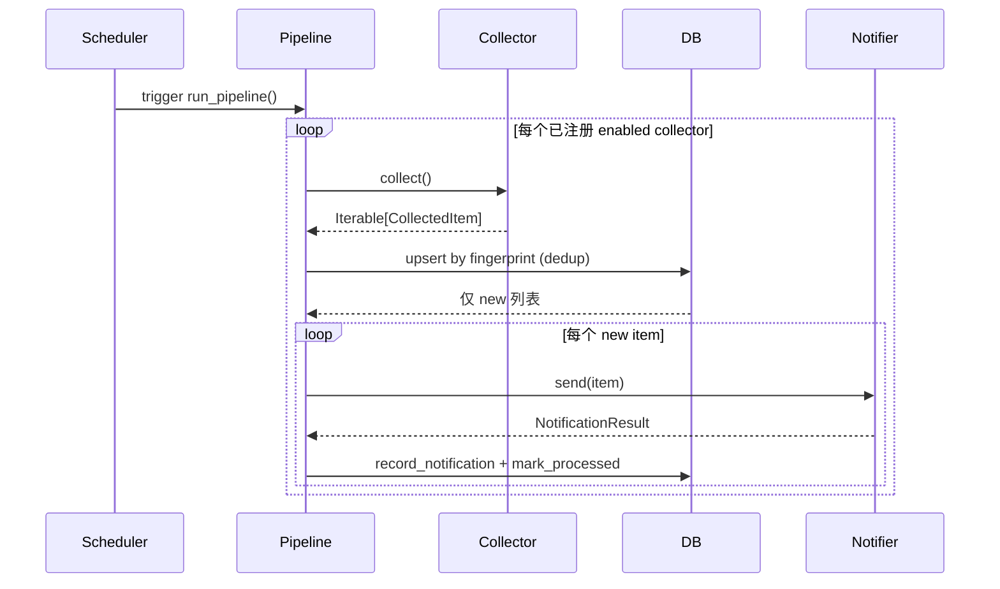

# 架构

## 一图概览

## 三层

### 1. Core（不可碰）

| 模块 | 职责 |
| --- | --- |
| `src/settings.py` | Pydantic Settings — 配置的唯一入口 |
| `src/logging.py` | structlog 配置（控制台 + 轮转文件 + 可选 JSON） |
| `src/scheduler.py` | APScheduler 单例封装 |
| `src/db/` | SQLAlchemy 2.0 typed mappings + 通用 CRUD |
| `src/core/` | `BaseCollector` / `BaseNotifier` 抽象 + 注册表 + Pipeline |

### 2. Plugins（你的代码）

| 目录 | 内容 |
| --- | --- |
| `src/collectors/` | 每个 .py 文件一个 `BaseCollector` 子类 |
| `src/notifiers/` | 每个 .py 文件一个 `BaseNotifier` 子类 |

**自动发现**：`load_plugins()` 用 `pkgutil.iter_modules` 走两个包，依次 `importlib.import_module` 触发 `@register_*` 装饰器副作用，写入注册表。

### 3. Surface

| 入口 | 说明 |
| --- | --- |
| `src/cli.py` | Typer 命令行：`serve` / `collect` / `list` / `db` / `version` |
| `src/web/` | FastAPI 应用工厂、健康检查、`/api/v1` REST、Jinja 仪表盘 |

## 数据流

## CollectedItem 设计

通用、CVE-不可知 — 任何来源（GHSA、RSS、Webhook、Discord 消息）都能套进来：

| 字段 | 说明 |
| --- | --- |
| `id` | 主键 |
| `collector` | 采集器名（`BaseCollector.name`） |
| `external_id` | 源系统的 ID（CVE-2024-xxxx / GHSA-xxxx / 邮件 Message-ID …） |
| `fingerprint` | **跨源去重唯一键**（必填） |
| `title` / `url` / `summary` | 基础展示三件套 |
| `payload` | JSON 自由结构 — 存 CVSS / EPSS / severity / 任何 source 特定字段 |
| `status` | `new` / `processed` / `notified` / `skipped` |
| `created_at` / `processed_at` | 时间戳 |

需要 CVE 专属字段？**别改表结构**，写进 `payload`。Web 与 API 透传 dict。

## 为什么这么设计

**不绑定 CVE 语义**：v3 把表结构焊死在 CVE 上，后果是想加 "GitHub 仓库变更"、"Discord 安全公告" 等非 CVE 来源就要改 schema。v4 通用化后，每个 collector 只对自己负责的 payload 结构。

**Pipeline 不感知插件名**：注册表透明，启动期靠 pkgutil 扫描，没有任何 `if source == "cisa_kev"` 类硬编码。新增源只需新加一个文件。

**通知去重**：`(item_id, notifier_name)` 唯一约束防止跨 cycle 重复推送。

**Web 只读**：API 全 GET，无写入端点，无登录。可直接面向公网，最差也只是被爬数据。
